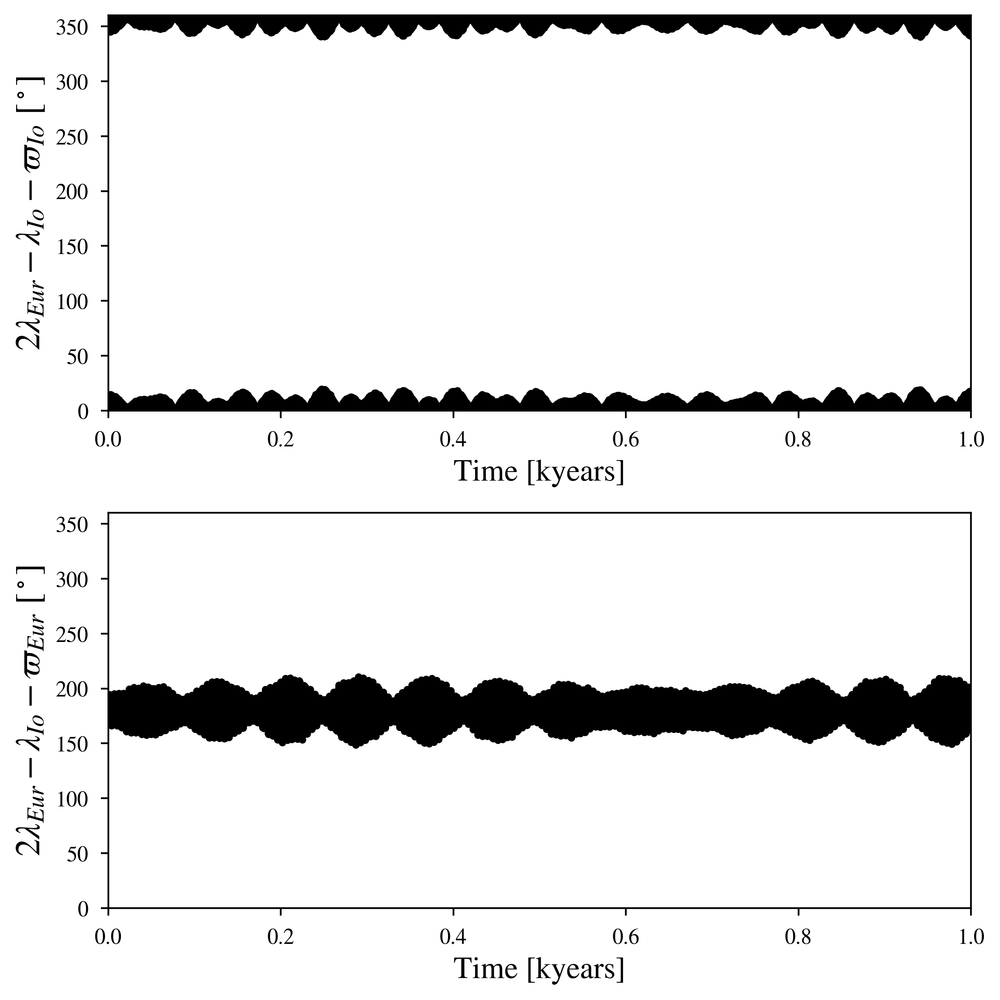
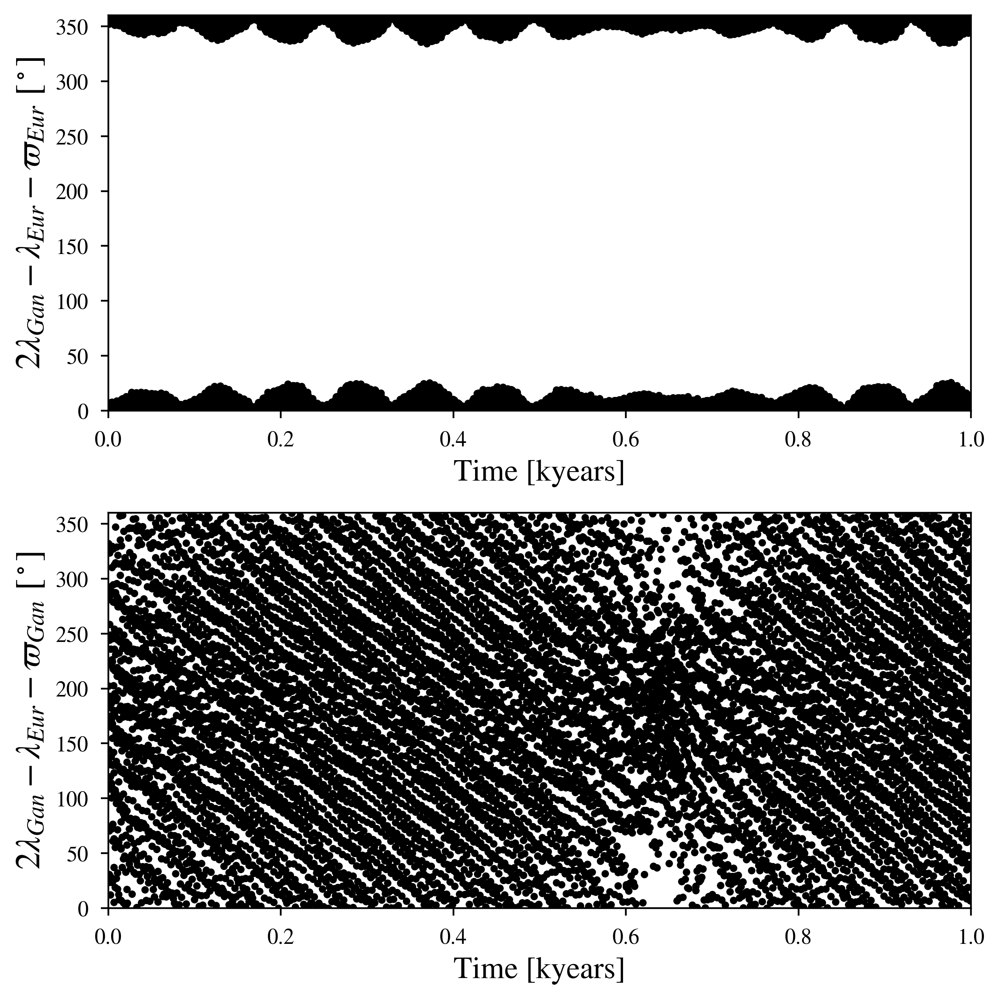
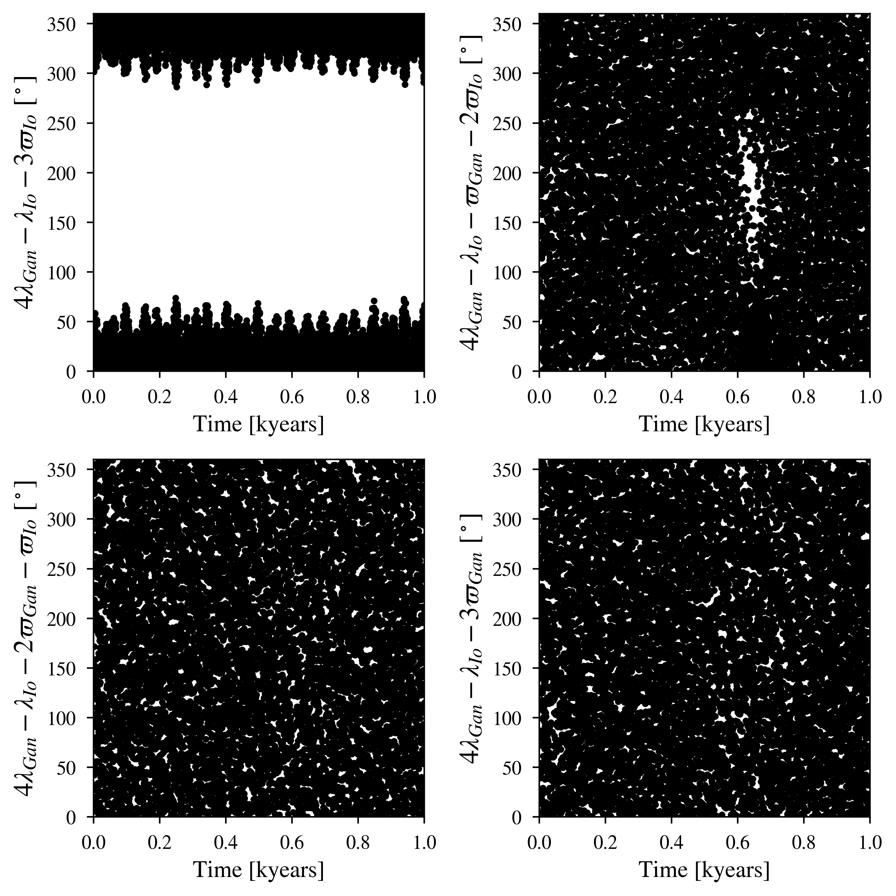

The Galilean Moons: Multiple Resonant pairs between 4:2:1
============

--------

Simulation Info:

===================   ============
**Date**              2023/08/01
**Author**            David Graham
**Modules**           SpiNBody
**Approx. runtime**   5 min (3.8 GHz CPU base clock)
===================   ============

This example produces all potential 1st-3rd order orbital frequency ratios of all the Galilean satellite pairs in the Jovian system. While VMMR can confirm the two first order resonances and the single 3rd order resonance (Ganymede-Io, 4:1), these figures do not show the Laplace Resonant Arguments.

To run this example
-------------------

.. code-block:: bash
    # Run vplanet to produce the results
    vplanet vpl.in

    # Run the calculator to produce the png files.
    python vmmr.py png
    
    # If you want to observe the next image, press "x" on the currently observed image.

    # To produce pdf files
    python vmmr.py pdf

Expected output
---------------

