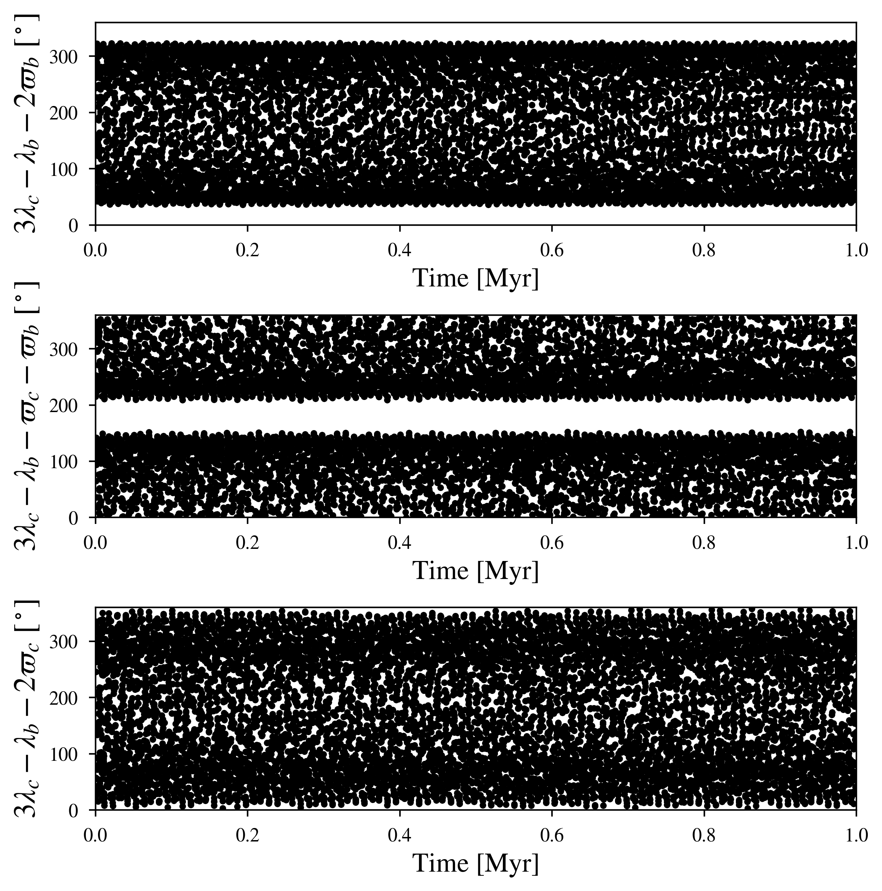

HD 60532 (2 Confirmed Planets): a 3:1 Second Order Resonance
============

--------

Simulation Info:

===================   ============
**Date**              2023/08/01
**Author**            David Graham
**Modules**           SpiNBody
**Approx. runtime**   7 minutes (3.8 GHz CPU base clock)
===================   ============

This example produces the 3:1 MMR of planets b and c in the system. The initial values of HD 60532 were obtained from this publication (Borgniet et al. 2017): https://arxiv.org/pdf/1608.08257.pdf 
The inclinations were set to 20 degrees from an older paper with similar values (Desort et al. 2008), but one can also set them to zero since the planets are coplanar. While HD 60532 is the best example of an Exoplanetary system with a 2nd order MMR, there is still incomplete information, such as the planets' inclination and the Longitude of Ascending Node. Since the inclination is not well known, I used the potential minimum masses of the two planets. The Mean Anomaly is not present in the paper, however I calculated it based off of the known information of the planets' transit times and other orbital elements.

To run this example
-------------------

.. code-block:: bash
    # Run vplanet to produce the results
    vplanet vpl.in
    
    # Run the calculator to produce the png files.
    python vmmr.py png
    
    # If you want to observe the next image, press "x" on the currently observed image.

    # To produce a pdf
    python vmmr.py pdf

Expected output
---------------

Even with the lack information, the two planets still show a case of high-amplitude libration for 2 out of the 3 resonant arguments for up to 1 million years.
