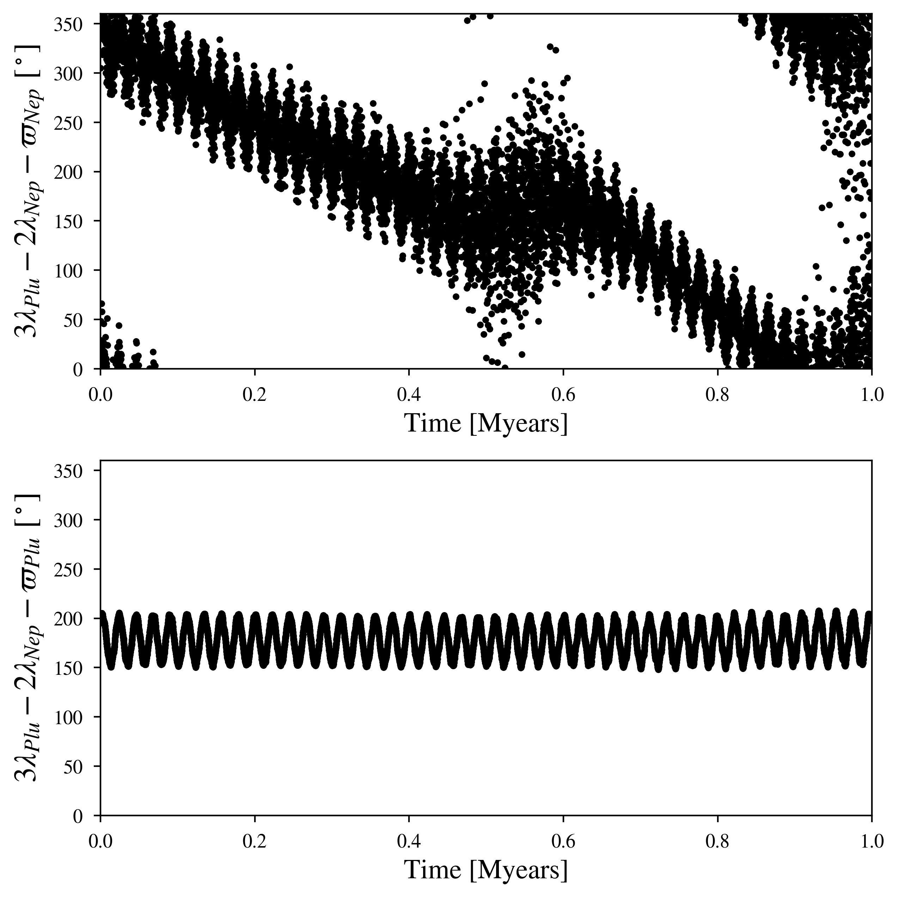

N-body Orbital Evolution of the Solar System: Pluto-Neptune
============

Overview
--------

Resonant Argument pairs of the solar system

===================   ============
**Date**              2023/08/01
**Author**            David Graham
**Modules**           SpiNBody
**Approx. runtime**   1 hour (3.8 GHz CPU base clock)
===================   ============

This example produces all potential 1st-3rd order orbital frequency ratios of all planetary pairs in the solar system. 

To run this example
-------------------

.. code-block:: bash

    # Run the calculator to produce the png files.
    python VMMR_Calc.py png
    
    # If you want to observe the next image, press "x" on the currently observed image.

    # To produce a pdf
    python VMMR_Calc.py pdf

Expected output
---------------

VPLanet shows that the Pluto-Neptune 3:2 MMR remains stable up to 1 million years. The Resonant argument on the top panel slowly circulates roughly every 800 kyears while on the bottom panel the angle centers itself at 180 degrees and remains librating.
