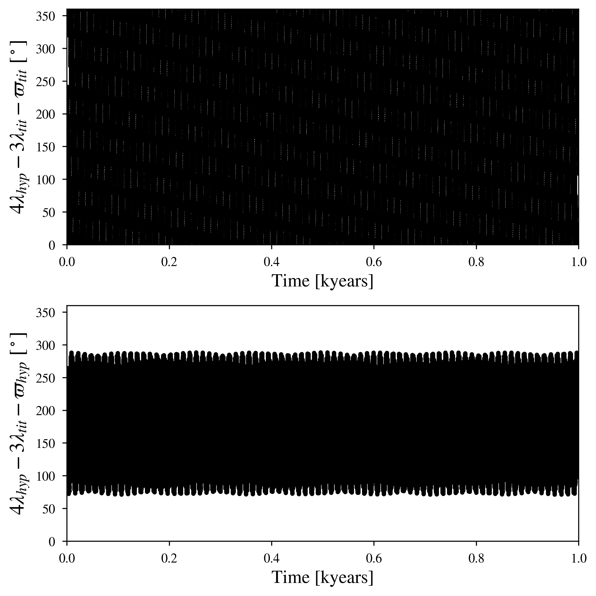

Hyperion and Titan: a 4:3 First Order Resonance
============

--------

Simulation Info:

===================   ============
**Date**              2023/08/01
**Author**            David Graham
**Modules**           SpiNBody
**Approx. runtime**   1 minute (3.8 GHz CPU base clock)
===================   ============

This example produces only one pair of the Hyperion-Titan 4:3 Mean Motion Resonance (first order resonance). One could introduce the other major Saturnian moons to confirm if the Resonant Arguments remain the same.  

To run this example
-------------------

.. code-block:: bash
    # Run vplanet to produce the results
    vplanet vpl.in
    
    # Run the calculator to produce the png files.
    python vmmr.py png
    
    # If you want to observe the next image, press "x" on the currently observed image.

    # To produce a pdf
    python vmmr.py pdf

Expected output
---------------

Hyperion and Titan remain stable up to 1000 years as shown in the bottom panel, where the Resonant Argument oscillates at a high amplitude around 180 degrees.
